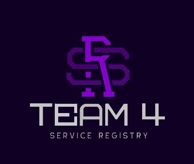

# TINF19C-Team-4-Service-Registry

### Welcome!

The upcoming Service-Registry is developed with the aim to improve and expand an existing software, which was originally developed by the previous course. 

## Contributors
- [Daniel Baumann](https://github.com/DanielErich)
- [Tim Diehl](https://github.com/timthom5) († exmatrikuliert)
- [Goran Erdeljan](https://github.com/GoranErdeljan)
- [Serdar Ilhan](https://github.com/serdarilhan)
- [Benedict Wetzel](https://github.com/wetzelbe) 

## About the Project

An asset in the meaning of Industry 4.0 can both be a single device and a Docker hosted
application. In both cases there must be a way to announce the offered capabilities via a
service discovery mechanism. A suitable mechanism for this is DNS-SD [1] [2].
The system will combine the capabilities of DNS-SD and the already existing Service-Registry
developed by the OI4-Alliance. The Open Industry 4.0 Alliance is a collaboration between
multiple Companies whose goal is to connect the companies and publish recommendations
on which the companies can make better decisions regarding Industry 4.0.
A Service Registry is an application that offers a list of available Services in the network. It
makes it possible for Users and other applications to find a service, that matches their
requirements. Therefore, a Service-Registry shall also contain Data about the capabilities of
the service.
The to be developed application must make it possible to, on the one hand use the DNS-SD
mechanism to discover Services, that aren't already known to the Service Registry and on the
other hand announce the already known Services via DNS-SD in the Network.
The new interface must be implemented and integrated into an Example project on Linux. The
interface must, just like the provided Service Registry, run in a Docker environment. The
Docker Environment will also contain a MQTT-Broker, which hosts the OI4-MessageBus.
Additionally, there must be test applications, which also run in Docker Containers. These testapplications shall be able to list the services, that were announced over the network, via a
simple GUI. The developed applications shall be made publicly available in form of an opensource project.
